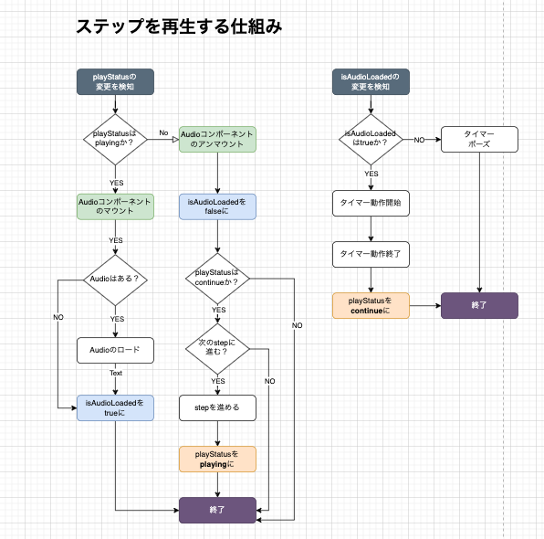
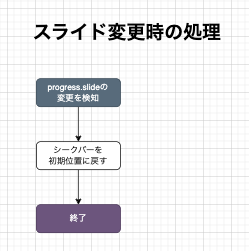
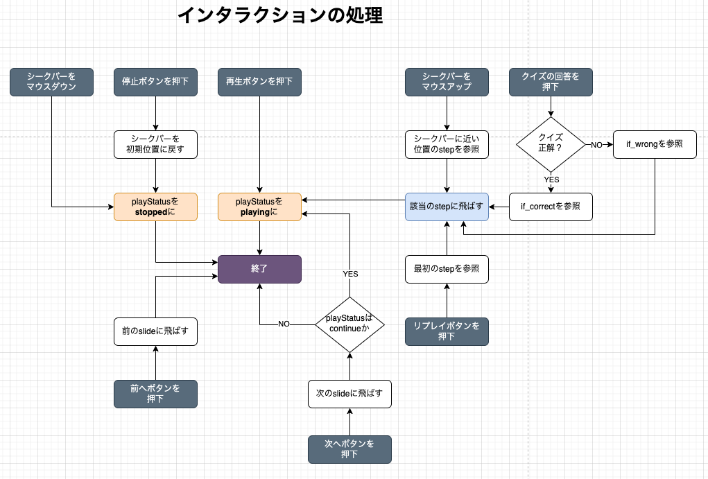

# SRN-IBL-LECTURE
探究学習のレクチャーコンテンツ用コンポーネント

# フロー




# ビルド
`npm-version`のコマンドライン引数の入力がトリガーになる。  
↓ のいずれか
```
<newversion> | major | minor | patch | premajor | preminor | prepatch | prerelease | from-git
```
## ビルド後の流れ
- `npm-version`コマンドに応じてバージョンが上がる
  - バージョンを含んだブランチが作成される
    - 適宜`master`にマージすること
